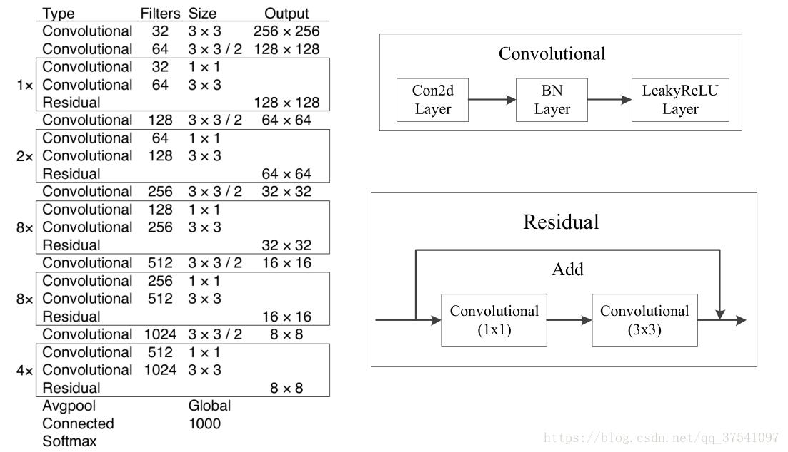

# ML-Object-detection
In this project we are going to learn how to run one of the most popular object detection algorithms YOLOv3.

## What is YOLO?
YOLO (You Only Look Once) is a family of deep learning models designed for fast object Detection.
There are many versions of YOLO, we are using YOLO version 3.
The first version proposed the general architecture, where the second version refined the design and made use of predefined anchor boxes to improve the bounding box proposal, and version three further refined the model architecture and training process.
It is based on the idea that:
" A single neural network predicts bounding boxes and class probabilities directly from full images in one evaluation. Since the whole detection pipeline is a single network, it can be optimized end-to-end directly on detection performance. "

## Object detecion steps in YOLOv3
*	The input is a batch of images of shape (m, 416, 416, 3).
*	YOLO v3 passes this image to a convolutional neural network (CNN).
*	The last dimensions of the output are flattened to get an output volume of (19, 19, 425):
    *	Here, each cell of a 19 x 19 grid returns 425 numbers.
    *	425 = 5 * 85, where 5 is the number of anchor boxes per grid.
    *	85 = 5 + 80, where 5 is (pc, bx, by, bh, bw) and 80 is the number of classes we want to detect.
*	The output is a list of bounding boxes along with the recognized classes. Each bounding box is represented by 6 numbers (pc, bx, by, bh, bw, c). If we expand c into an 80-dimensional vector, each bounding box is represented by 85 numbers.
*	Finally, we do the IoU (Intersection over Union) and Non-Max Suppression to avoid selecting overlapping boxes.

## Darknet-53
Darknet-53 is a convolutional neural network that acts as a backbone for the YOLOv3 object detection approach. Darknet-53 is used as a feature extractor.
DarkNet-53 is a convolutional neural network that is 53 layers deep. 
Darknet-53 mainly composed of 3 x 3 and 1 x 1 filters with skip connections like the residual network in ResNet.

## YOLOv3 architecture
*	YOLO v3 uses a variant of Darknet, which originally has 53 layer network trained on Imagenet.
*	For the task of detection, 53 more layers are stacked onto it, giving us a 106 layer fully convolutional underlying architecture for YOLO v3.
*	In YOLO v3, the detection is done by applying 1 x 1 detection kernels on feature maps of three different sizes at three different places in the network.

*	The shape of detection kernel is 1 x 1 x (B x (5 + C)). Here B is the number of bounding boxes a cell on the feature map can predict, '5' is for the 4 bounding box attributes and one object confidence and C is the no. of classes.
In our project we can see B of each detection kernels of our three (the number bounding boxes each output layer can predict) as follows:

## How to use YOLOv3
First we need to download the model files. Weights and cfg (or configuration). files can be downloaded from the website of the original creator of YOLOv3 >> [LINK](https://pjreddie.com/darknet/yolo).

Download the model files and put them in the same directory of the project file.

This model is pre-trained on the COCO dataset, Using COCO’s pre-trained weights means that you can only use YOLO for object detection with any of the 80 pre-trained classes that come with the COCO dataset. This is a good option for beginners because it requires the least amount of new code and customization. 
The following 80 classes are available using COCO’s pre-trained weights:

